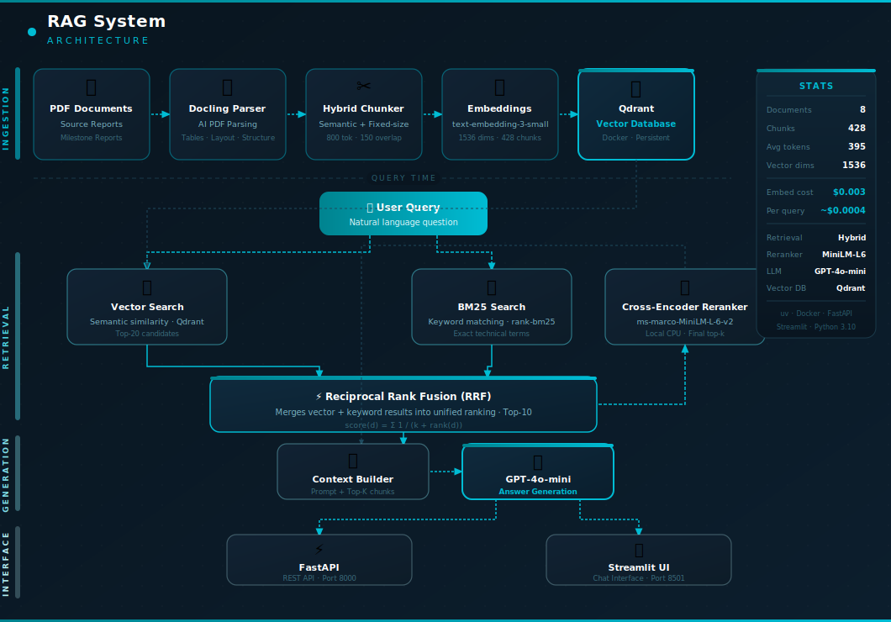

# RAG System

A production-ready **Retrieval-Augmented Generation (RAG)** system built for the a project deliverables, enabling natural language Q&A over technical milestone reports using hybrid search and cross-encoder reranking.

---

## Architecture



## Tech Stack

| Component | Technology |
|---|---|
| PDF Parsing | [Docling](https://github.com/DS4SD/docling) |
| Chunking | Hybrid (Semantic + Fixed-size with overlap) |
| Embeddings | OpenAI `text-embedding-3-small` |
| Vector Database | [Qdrant](https://qdrant.tech/) (Docker or Qdrant Cloud) |
| Keyword Search | BM25 (`rank-bm25`) |
| Reranking | Cohere `rerank-v3.5` API (free tier) |
| LLM | OpenAI `gpt-4o-mini` |
| API | FastAPI + Uvicorn |
| Frontend | Streamlit (multipage) |
| Monitoring | SQLite + Streamlit dashboard |
| Deployment | Render (backend) + Streamlit Community Cloud (frontend) |
| Package Manager | [uv](https://github.com/astral-sh/uv) |

---

## Project Structure

```
rag-system/
├── data/
│   ├── raw/                  # PDF source documents (not in repo)
│   ├── processed/            # Docling output — markdown + JSON
│   ├── chunks/               # Chunked documents
│   ├── embeddings/           # OpenAI embedding vectors
│   └── qdrant/               # Qdrant persistent storage
├── src/rag_system/
│   ├── ingestion/            # PDF loading and chunking
│   │   ├── chunker.py        # Hybrid chunker
│   │   └── preprocessor.py   # Markdown cleaner
│   ├── embeddings/           # OpenAI embedding wrapper
│   │   ├── embedding_model.py
│   │   └── batch_processor.py
│   ├── vectorstore/          # Qdrant integration
│   │   ├── store.py          # Search and upsert (local + cloud)
│   │   └── indexer.py        # Index builder
│   ├── retrieval/            # Retrieval pipeline
│   │   ├── retriever.py      # Vector search
│   │   ├── hybrid_search.py  # BM25 + RRF fusion
│   │   └── reranker.py       # Cohere Rerank API client
│   ├── generation/           # LLM answer generation
│   │   ├── llm_client.py     # OpenAI GPT-4o-mini client
│   │   ├── response_generator.py  # Full RAG pipeline
│   │   └── prompts.py        # Prompt templates
│   ├── monitoring/           # Query monitoring layer
│   │   └── database.py       # SQLite logging (init, log, flag)
│   └── api/                  # FastAPI layer
│       ├── app.py            # Application entry point
│       ├── routes.py         # API endpoints (query + monitor)
│       └── models.py         # Request/response models
├── scripts/
│   ├── ingest_documents.py   # Step 1: Parse PDFs
│   ├── create_chunks.py      # Step 2: Chunk documents
│   ├── create_embeddings.py  # Step 3: Generate embeddings
│   ├── populate_vectordb.py  # Step 4: Load into Qdrant
│   ├── test_retrieval.py     # Step 5: Test retrieval pipeline
│   ├── serve.py              # Start FastAPI server
│   └── ask.py                # CLI chat interface
├── frontend/
│   ├── streamlit_app.py      # Page 1 — Chat UI
│   ├── auth.py               # Shared login gate helper
│   └── pages/
│       └── 2_Monitoring.py   # Page 2 — Monitoring dashboard
├── data/
│   └── monitoring/
│       └── queries.db        # SQLite query log (auto-created, not in repo)
├── docker/
│   └── docker-compose.yml    # Qdrant + app services
├── .streamlit/
│   ├── config.toml           # Streamlit theme (committed)
│   └── secrets.toml          # Credentials — never commit
├── requirements.txt          # Frontend deps for Streamlit Cloud
├── requirements-backend.txt  # Backend deps for Render / Docker
├── render.yaml               # Render deployment config
├── Dockerfile                # Backend container image
├── .dockerignore
├── pyproject.toml
├── .env                      # API keys (never commit)
└── Makefile
```

---

## Prerequisites

- Python 3.10+
- [uv](https://github.com/astral-sh/uv) package manager
- Docker & Docker Compose
- OpenAI API key

---

## Setup

### 1. Clone the repository

```bash
git clone <your-repo-url>
cd rag-system
```

### 2. Install dependencies

```bash
uv sync
```

### 3. Configure environment

```bash
cp .env.example .env
# Edit .env and add your OpenAI API key
```

`.env` file:
```env
OPENAI_API_KEY="sk-..."
```

### 4. Start Qdrant

```bash
make vectordb-up
```

---

## Running the Pipeline

Run each step in order the first time. After that, only re-run steps when your documents change.

```bash
# Step 1 — Parse PDFs with Docling (AI-powered, ~500MB models downloaded once)
make ingest

# Step 2 — Chunk documents (hybrid semantic + fixed-size)
make chunk

# Step 3 — Generate OpenAI embeddings (~$0.003 for 428 chunks)
make embed

# Step 4 — Load embeddings into Qdrant
make populate

# Or run all pipeline steps at once
make pipeline
```

---

## Running the App

You need two terminals:

```bash
# Terminal 1 — FastAPI backend (port 8000)
make serve

# Terminal 2 — Streamlit frontend (port 8501)
make streamlit
```

Then open **http://localhost:8501** in your browser.

- **Chat** — main page, ask questions over the documents
- **Monitoring** — second page in the sidebar, shows the query log and cost dashboard

The interactive API docs are available at **http://localhost:8000/docs**.

---

## API Endpoints

| Method | Endpoint | Description |
|---|---|---|
| `GET` | `/api/v1/health` | System health check |
| `POST` | `/api/v1/query` | Ask a question (blocking) |
| `POST` | `/api/v1/query/stream` | Ask a question (streaming SSE) |

### Example request

```bash
curl -X POST http://localhost:8000/api/v1/query \
  -H "Content-Type: application/json" \
  -d '{"question": "What is the power consumption of the C-PON system?", "top_k": 5}'
```

### Example response

```json
{
  "question": "What is the power consumption of the C-PON system?",
  "answer": "The C-PON system power consumption increases with traffic load...",
  "sources": [
    {
      "source_file": "MS7_ECOICE Report Final Draft",
      "headers": ["5.2 Power Consumption Measurement"],
      "rerank_score": 7.71
    }
  ],
  "model": "gpt-4o-mini-2024-07-18",
  "prompt_tokens": 2404,
  "completion_tokens": 147,
  "cost_usd": 0.000449
}
```

---

## Monitoring & Evaluation

Every query is automatically logged to a local SQLite database (`data/monitoring/queries.db`) with no extra code needed. The monitoring dashboard is the second page in the Streamlit sidebar.

### What gets logged

| Field | Description |
|---|---|
| `timestamp` | UTC time of the request |
| `question` | The user's question |
| `answer` | The generated answer |
| `sources` | Chunk sources returned (JSON) |
| `latency_ms` | End-to-end response time |
| `cost_usd` | OpenAI token cost for that query |
| `prompt_tokens` | Tokens sent to the LLM |
| `completion_tokens` | Tokens in the LLM response |
| `top_reranker_score` | Score of the highest-ranked chunk |
| `flagged` | Whether the response was flagged for review |

> Streaming queries (`/query/stream`) log `cost_usd = null` because the OpenAI streaming API does not expose token counts.

### Accessing the dashboard

Open the **Monitoring** page from the Streamlit sidebar. It shows:

- Summary metrics — total queries, cumulative cost, average latency, average reranker score, flagged count
- Latency and reranker score charts over time
- Full query log table with a **Flag for review** toggle per row

### Flag for review

Check the **Flag** box next to any query in the table and click **Save flag changes**. Flagged queries are highlighted and counted in the summary bar — useful for identifying answers that need prompt or retrieval tuning.

### Monitoring API endpoints

| Method | Endpoint | Description |
|---|---|---|
| `GET` | `/api/v1/monitor/queries` | Retrieve all logged queries |
| `POST` | `/api/v1/monitor/flag/{id}` | Set or clear the flag on a query |

### Database path

The default path is `data/monitoring/queries.db` relative to the project root. Override it with the `MONITORING_DB_PATH` environment variable — useful when running on a cloud host with a persistent volume.

---

## Makefile Reference

```bash
make install          # Install dependencies
make ingest           # Parse PDFs with Docling
make chunk            # Chunk processed documents
make embed            # Generate OpenAI embeddings
make populate         # Load embeddings into Qdrant
make pipeline         # Run ingest + chunk in sequence
make serve            # Start FastAPI server
make streamlit        # Start Streamlit frontend
make test-retrieval   # Test the retrieval pipeline
make ask              # Interactive CLI chat
make vectordb-up      # Start Qdrant in Docker
make vectordb-down    # Stop Qdrant
make view-chunks      # Inspect chunking stats
make format           # Format code with black + ruff
make test             # Run tests
```

---

## Retrieval Pipeline

The system uses a 3-stage retrieval approach for maximum accuracy:

1. **Vector Search** — embeds the query with OpenAI and finds the top 20 semantically similar chunks from Qdrant
2. **BM25 + RRF** — performs keyword search in parallel and fuses both result lists using Reciprocal Rank Fusion, reducing to top 10
3. **Cross-encoder Reranking** — a local `ms-marco-MiniLM-L-6-v2` model scores each (query, chunk) pair together for maximum precision, returning the final top-k

This hybrid approach is particularly effective for technical documents where both semantic meaning and exact terminology (e.g. "C-PON", "DT15", "OLM") matter.

---

## Chunking Strategy

Documents are chunked using a hybrid strategy:

- **Semantic** — split on markdown headers (`##`, `###`) to respect document structure
- **Merged** — sections smaller than 100 tokens are merged with neighbours to avoid tiny chunks
- **Fixed-split** — sections larger than 800 tokens are split with 150-token overlap, snapping to sentence boundaries

Default settings (tuned for `text-embedding-3-small`):

| Parameter | Value |
|---|---|
| Max chunk tokens | 800 |
| Overlap tokens | 150 |
| Min chunk tokens | 100 |

---

## Cost Estimates

Based on 8 documents / 428 chunks:

| Operation | Cost |
|---|---|
| Embedding (one-time) | ~$0.003 |
| Per query | ~$0.0003–$0.0005 |
| 1,000 queries | ~$0.40 |

---

## Adding New Documents

1. Drop PDF files into `data/raw/`
2. Re-run the pipeline:

```bash
make ingest && make chunk && make embed && make populate
```

> Note: `make populate` will skip recreating the collection by default. To force a full rebuild, change `recreate=False` to `recreate=True` in `scripts/populate_vectordb.py`.

---

## Deployment

The system is split into two independently deployed services.

### Backend — Render

The FastAPI backend is deployed on [Render](https://render.com) using `render.yaml`. Configuration is picked up automatically when you connect the repo.

**Memory constraint — why Cohere Rerank API is used**

The original pipeline used a local `sentence-transformers` cross-encoder for reranking, which loads PyTorch (~350 MB) at startup. Combined with the rest of the dependencies, the server exceeded Render's free tier 512 MB RAM limit and was killed on every cold start.

The fix was to replace the local model with the **Cohere Rerank API** (`rerank-v3.5`). The model runs on Cohere's servers — the app sends an HTTP request and receives relevance scores. This drops the server's memory footprint from ~600 MB to ~120 MB, making it viable on the free tier. Reranking quality is equivalent or better.

Cohere free tier: **1,000 rerank calls/month** — sufficient for a project demo.

**Environment variables to set in the Render dashboard:**

| Variable | Description |
|---|---|
| `OPENAI_API_KEY` | Your OpenAI key |
| `QDRANT_URL` | Qdrant Cloud cluster URL |
| `QDRANT_API_KEY` | Qdrant Cloud API key |
| `COHERE_API_KEY` | Cohere Rerank API key (free at dashboard.cohere.com) |
| `CHUNKS_DATA_PATH` | Path to chunks.json (see below) |
| `API_BEARER_TOKEN` | Bearer token protecting `/query` and `/monitor` endpoints — generate with `python -c "import secrets; print(secrets.token_hex(32))"` |

**Sensitive data — chunks.json**

`chunks.json` contains processed document text and is gitignored. On Render, use **Secret Files**:

1. Render dashboard → your service → **Environment** → **Secret Files**
2. Filename: `chunks.json` — Render mounts it at `/etc/secrets/chunks.json`
3. Set `CHUNKS_DATA_PATH=/etc/secrets/chunks.json` in environment variables

The app auto-detects `/etc/secrets/chunks.json` even if the env var is not set.

**Build & start commands:**

```
Build:  pip install -r requirements-backend.txt
Start:  PYTHONPATH=src python scripts/serve.py
```

### Frontend — Streamlit Community Cloud

The Streamlit frontend is deployed on [Streamlit Community Cloud](https://share.streamlit.io).

1. Connect the GitHub repo on share.streamlit.io
2. Set **Main file path** to `frontend/streamlit_app.py`
3. Under **Advanced settings → Secrets**, paste:

```toml
[auth]
username = "admin"
password = "your-password"

[api]
base_url = "https://your-render-service.onrender.com/api/v1"
bearer_token = "your-api-bearer-token"
```

Secrets added after deployment take effect immediately on the next reboot — no redeploy needed.

### Authentication

Two layers of authentication protect the system:

1. **Streamlit login gate** (`frontend/auth.py`) — username/password form in front of all pages. Skipped automatically when `[auth]` is absent from secrets (local dev).

2. **FastAPI bearer token** — the `/query` and `/monitor` endpoints require an `Authorization: Bearer <token>` header. Set `API_BEARER_TOKEN` in the Render dashboard and the matching `bearer_token` in the Streamlit secrets. When `API_BEARER_TOKEN` is unset the backend runs in open mode (suitable for local dev only).

### Qdrant Cloud

To use Qdrant Cloud instead of local Docker, set:

```env
QDRANT_URL=https://your-cluster.cloud.qdrant.io
QDRANT_API_KEY=your-qdrant-api-key
```

The vector store automatically switches between local Docker and Qdrant Cloud based on whether `QDRANT_URL` is set.

### Docker (run anywhere)

A `Dockerfile` is included for running the backend on any host that supports containers (AWS ECS, GCP Cloud Run, Railway, Fly.io, local Docker, etc.).

**Build the image:**
```bash
docker build -t rag-api .
```

**Run with Qdrant Cloud:**
```bash
docker run -p 8000:8000 \
  -e OPENAI_API_KEY=sk-... \
  -e QDRANT_URL=https://your-cluster.cloud.qdrant.io \
  -e QDRANT_API_KEY=your-qdrant-key \
  -e COHERE_API_KEY=your-cohere-key \
  -v /path/to/chunks.json:/data/chunks.json \
  -e CHUNKS_DATA_PATH=/data/chunks.json \
  rag-api
```

**Run with local Qdrant:**
```bash
# Start Qdrant first
make vectordb-up

docker run -p 8000:8000 \
  -e OPENAI_API_KEY=sk-... \
  -e QDRANT_HOST=host.docker.internal \
  -e QDRANT_PORT=6333 \
  -e COHERE_API_KEY=your-cohere-key \
  -v /path/to/chunks.json:/data/chunks.json \
  -e CHUNKS_DATA_PATH=/data/chunks.json \
  rag-api
```

The image is ~200 MB (no PyTorch). `chunks.json` is never baked into the image — always mount it at runtime via `-v`.

### Live URLs

| Service | URL |
|---|---|
| FastAPI backend | `https://your-service.onrender.com` |
| API docs (Swagger) | `https://your-service.onrender.com/docs` |
| Streamlit frontend | `https://your-app.streamlit.app` |

---

## License

MIT